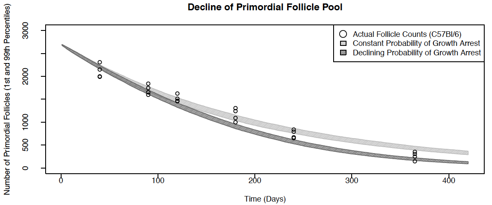
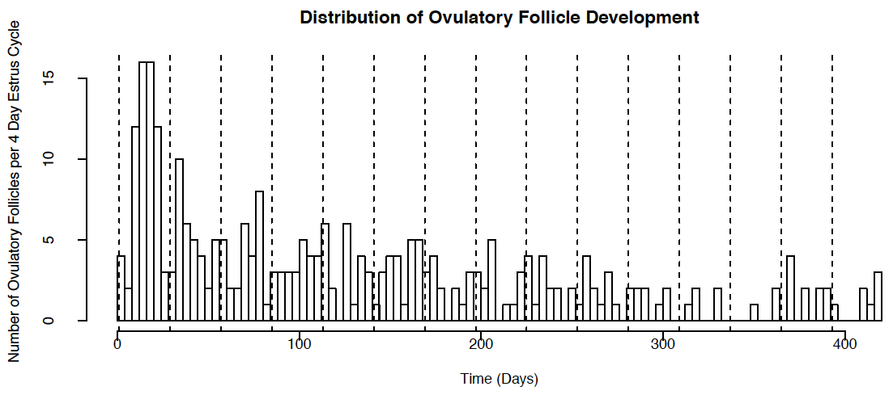

# ŌvSim

**Organism selection note**: OvSim's default settings simulate follicle dynamics of the *mouse* ovary. A mouse simulation of ~3000 follicles over 420 days of postnatal life runs in several minutes on modern hardware. Preliminary experimental settings for the simulation of the *human* ovary (30-50,000 follicles / 25 years of simulated time - runs in several **hours**) can be found in [hŌvSim](hOvSim_R_Code) and example human simulation output can be found below and in [hŌvSim Figures](hOvSim_Figures).

During postnatal life, thousands of follicles each containing an egg cell (oocyte) growth activate, grow, and die within the mammalian ovary. Growth occurs when a few pre-granulosa cells around an oocyte begin to proliferate. Little is known of the factors that control which follicles growth activate and which follicles survive to complete development and ovulate. Tools for the simulation and visualization of dynamic [follicle development](https://en.wikipedia.org/wiki/Ovarian_follicle) have not been available. We hypothesized that establishing a simple set of rules for i) follicle growth activation, ii) granulosa cell proliferation, iii) granulosa cell death, and iv) individual follicle survival could provide the necessary starting points for a rudimentary simulation of stochastic follicle behavior over time. 

Using a [discrete time Markov chain (DTMC)](https://en.wikipedia.org/wiki/Markov_chain) approach (Figure 1, below), we produced a function in the R language called ŌvSim (file [ovsim.R](OvSim_R_Code/ovsim.R)), that can be used to conduct simulations of ovarian follicle population development that vary based on the above user-specified parameters (or inputs).

To our surprise, the simple DTMC model produced remarkably accurate representations of follicle population dynamics, closely matching the biologically observed number of surviving follicles (and thus an estimate of ovulated eggs) over time. Although this does not prove that the apparently complex process of follicle population dynamics is simple, the results show that a relatively simple probability-dependent process is consistent with and could help us better understand the process of follicle development in nature.

ŌvSim was designed using known biological features of ovarian follicles while allowing users to set certain parameters (below). Once the script is activated, a numerical matrix is populated with values corresponding to the starting number of granulosa cells in individual simulated follicles. The matrix is initially populated with primordial follicles, randomly-generated such that they can contain one, two, or three pregranulosa cells.

For a truncated example, consider *n* matrix entries (containing the number 1, 2, or 3), representing *n* growth arrested ovarian "follicles" that contain 1, 2, or 3 pregranulosa cells at start. Upon activating the simulation, a subset of follicles can growth activate at each step, while the remainder will remain growth-arrested and maintain an unchanged number of pregranulosa cells. Instead, growing follicles double in granulosa cell population at each step, minus a user-controlled factor of granulosa cell death. At each step, follicles thus grow exponentially (minus the cell death factor) or die. If a follicle that had begun to grow commits to death (atresia), its granulosa cell number is set to zero.

In ŌvSim, the starting number of follicles in the ovary (*NF*), the number of days of time (*ND*) to run the simulation, and the length of the ovulatory cycle (*cyclength*) can all be specified. We set the number of *mouse* ovarian follicles to 3000, including 2700 primordial follicles for most of our studies. Ovulatory cycle length for mice is set at 4, 4.5, or 5 days. The script then continues to loop with "daily" probability calculations and operations upon each follicle entry in the matrix. A flow chart of the operations upon each matrix entry is shown in Figure 1. 

An example of variable entry into the *follicle* function as shown in the following example. 

	follicle <- function(NF = 3000,
         ND = 420,
         IGP = 300,
         phold = 0.995,
         cond.pdub = 0.9,
         pcelllive = 0.8,
         cyclength = 4,
         ejectnum = 50000,
         puberty = TRUE,
         verbose = TRUE,
         pdfname = NA)
	{

Here, 3000 total follicles are present at the start, 2700 of which are primordial (1-3 granulosa cells), and 300 are a prepubertal cohort of growing follicles with randomly generated granulosa cell number (when *puberty*=TRUE). The estrus cycle length is 4 days. The probabilities shown next to the arrows in the Markov state transition diagram in Figure 1 match these settings. A simulation run for 420 days (14 months) approximately matches the fertile lifespan of C57Bl/6 mice fed *ad libitum*.

ŌvSim generates .CSV and PDF output of the matrix generated by the script over simulated time. The script **"papercode.R"** can be used to run and produce the following plots. Panel 2A shows the trend of decline of the arrested primordial follicle pool over time after execution of the simulation 1000 times using **"papercode.R"**. The grey hatched area is the 1st and 99th percentiles of simulated data. Individual data points for [actual "wet lab" counts](OvSim_R_Code/C57BL6_Mouse_Primordial_Follicle_Counts.csv) of C57Bl/6 mouse follicles in histological sections at 6 weeks, 8 months, and 12 months (circles) are overlaid with simulated data. 

Panel 2B is a plot of the growth and death of individual follicles that die within the 420 days of simulated time. Granulosa cell number is represented by the dashed lines, and the time (and follicle "size") of death is indicated by the letter "D."

The last panel of mouse simulation data, Panel 2C, is a histogram plot of the distribution of follicles that survive to ovulatory size, grouped in 4 day increments equivalent to the modeled estrus (e.g., ovulatory) cycle length. The number of eggs available for ovulation each cycle are therefore depicted. ŌvSim also outputs the data in Panel C in text format, useful for finer analyses of ovulatory follicle number. 

### hOvSim

hOvSim is a "fork" of OvSim, really just R function settings tuned to reflect the human ovary's number of follicles and reproductive lifespan. The human ovary has evolved to ovulate one egg per ovulatory cycle using mechanism(s) that are not well understood. The process is referred to as follicle dominance. Keeping to the simple rules of ŌvSim, we depict the selection of the dominant follicle using a Markov state transition diagram as follows: 

Of the *x* follicles that survive and grow to the Antral stage of development per cycle, *1/x* is selected to complete development and ovulate, and the remaining *x-1/x* die. **This selection of a single dominant follicle is not currently modeled in hOvSim - instead, the total number of antral follicles that survive per cycle *and are thus available to be selected* are the output of the model**. 

Example output of hOvsim is found as follows, where 30,000 primordial follicles are present at the beginning, the stationary probability that each primordial follicle stays growth arrested (*phold*) = 0.9995, and the conditional probability that each growing follicle survives that day (*cond.pdub*) is 0.9. As of 1/1/16 the scale in the middle panel is set incorrectly [Issue 1](https://github.com/johnsonlab/OvSim/issues/1). For orientation's sake, if time zero is human age at menarche (puberty, ~15), age 35 is day 7300, age 40 is day 9125, and age 50 is day 12775 (the end of the simulation).

